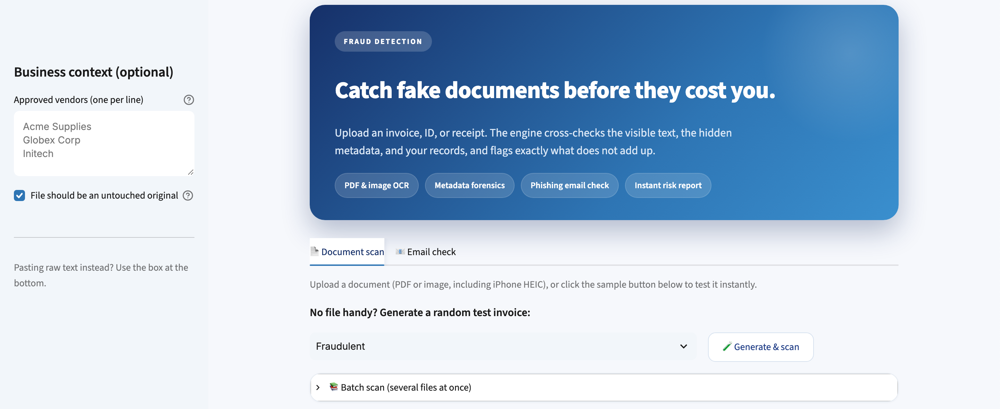

# Fraud & Phishing Scanner

Detects fraudulent documents and phishing emails by checking whether a file's
separate layers agree with each other, instead of guessing whether AI made it.

**Live demo:** https://fraud-ai-detection.com
&nbsp;·&nbsp; 



---

## What it does

- **Document fraud detection.** Upload an invoice, receipt, ID, or record (PDF
  or image, including iPhone HEIC). It flags inconsistencies with a risk score
  and the specific reason behind each flag.
- **Cross-modal checks.** Compares the printed text, the file's hidden metadata,
  and your own records (an approved-vendor list) against each other.
- **Image OCR.** Reads text off photos and scans (Tesseract) so image invoices
  get the same checks as PDFs.
- **Batch scanning.** Scan many files at once into a summary table, with a
  downloadable CSV and duplicate-invoice-number detection.
- **Phishing email checker.** Paste a suspicious email and it flags scam signals
  (urgent language, credential/payment requests, risky links, sender mismatch).
- **Built-in test data.** Generates realistic fraudulent or clean sample
  invoices on demand, so there's nothing to hunt for.

## How it works

The core idea is that a forger has to keep every layer of a document consistent,
and usually can't. The engine:

1. Extracts the visible text (via `pypdf` for PDFs, Tesseract OCR for images).
2. Extracts the hidden metadata (creation date, editing software) via `pypdf`
   and Pillow/EXIF.
3. Cross-checks them: a printed date that contradicts the file's real creation
   date, editing-software traces on a supposed original, a vendor absent from
   your records, duplicate or future-dated invoices, etc.

Each finding comes with evidence, a confidence level, and a plain-English
reason. It is a decision aid, not a verdict.

## Tech stack

Python · Streamlit · pypdf · Pillow · pytesseract (OCR) · reportlab · pytest ·
GitHub Actions (CI). Deployed on an Ubuntu VPS behind Nginx with a Let's Encrypt
HTTPS certificate, running as a systemd service.

## Run locally

```bash
pip install -r requirements.txt
streamlit run app.py
```

Image OCR also needs the system package: `apt install tesseract-ocr`
(or `brew install tesseract` on macOS). Without it, image scanning falls back
to metadata only.

## Tests

```bash
pip install pytest
pytest -q
```

Unit tests in `test_app.py` cover the detection logic and the sample generator.
CI runs them on every push via `.github/workflows/ci.yml`.

## Deployment

Runs as a systemd service on `127.0.0.1:8501`, with Nginx reverse-proxying the
domain and Let's Encrypt providing HTTPS. Update flow: `git pull` on the server,
then `systemctl restart scanner`.

## Background

This started as a business concept; the original product proposal is in
[PROPOSAL.md](PROPOSAL.md).
